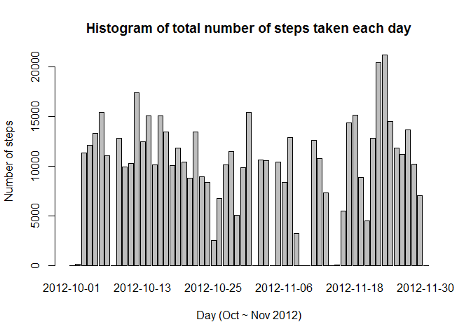
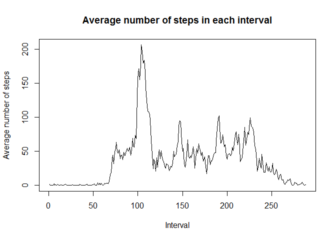
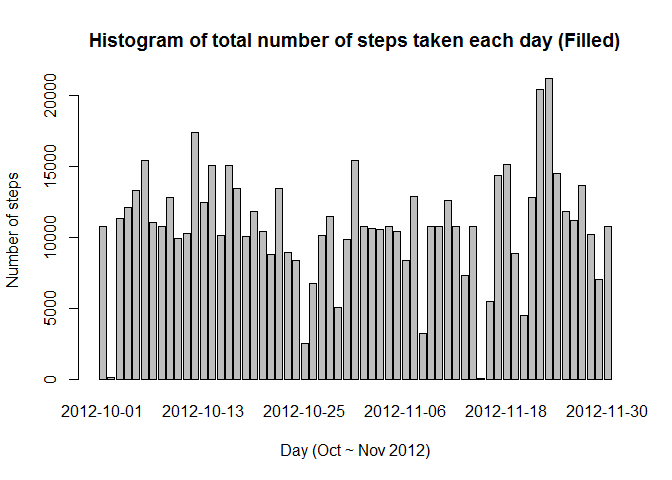
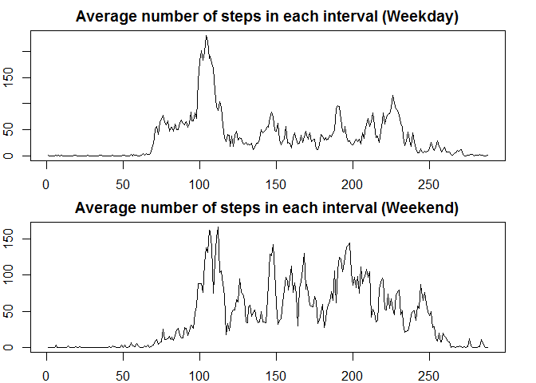

# Reproducible Research: Peer Assessment 1

## Loading and preprocessing the data


Unzip activity.zip file and load it into data variable

```r
# Unzip the zip file
unzip(zipfile="activity.zip")

# Load the data into the variable
data <- read.csv("activity.csv")
```


## What is mean total number of steps taken per day?

###1. Make a histogram of the total number of steps taken each day
###2. Calculate and report the mean and median total number of steps taken per day


Start by collapsing the data by summing up steps for each day. Then plot the histogram using barplot function.


```r
library(ggplot2)

# Collapsing the data by summing up steps for each day
totaldailysteps <- tapply(data$steps, data$date, FUN = sum, na.rm = TRUE)

# Plot the histogram using barplot function
barplot(totaldailysteps, main = "Histogram of total number of steps taken each day", xlab = "Day (Oct ~ Nov 2012)", ylab = "Number of steps")
```

 

```r
# Calculate the mean & median
mean(totaldailysteps, na.rm = TRUE)
```

```
## [1] 9354.23
```

```r
median(totaldailysteps, na.rm = TRUE)
```

```
## [1] 10395
```


## What is the average daily activity pattern?

###1. Make a time series plot (i.e. type = "l") of the 5-minute interval (x-axis) and the average number of steps taken, averaged across all days (y-axis)

###2. Which 5-minute interval, on average across all the days in the dataset, contains the maximum number of steps?


Start by collapsing the data by calculating the mean for each interval. Then plot the time series plot using plot function. Use the which.max function to display the interval having the maximum average steps.


```r
library(ggplot2)

# Collapsing the data by calculating the mean for each interval
averageintervalsteps <- tapply(data$steps, data$interval, FUN = mean, na.rm = TRUE)

# Plot the time series plot using plot function
plot(averageintervalsteps, type = "l", main = "Average number of steps in each interval", xlab = "Interval", ylab = "Average number of steps")
```

 

```r
# Display the interval having the maximum average steps
averageintervalsteps[which.max(averageintervalsteps)]
```

```
##      835 
## 206.1698
```


## Imputing missing values

###1. Calculate and report the total number of missing values in the dataset (i.e. the total number of rows with NAs)

###2. Devise a strategy for filling in all of the missing values in the dataset. The strategy does not need to be sophisticated. For example, you could use the mean/median for that day, or the mean for that 5-minute interval, etc.

###3. Create a new dataset that is equal to the original dataset but with the missing data filled in.

###4. Make a histogram of the total number of steps taken each day and Calculate and report the mean and median total number of steps taken per day. Do these values differ from the estimates from the first part of the assignment? What is the impact of imputing missing data on the estimates of the total daily number of steps?


Starty by identifying & displaying the number of missing values in the dataset. Then replicating average steps for each interval for the entire duration in the dataset (61 days). The missing values is then replaced with average steps for the corresponding interval. A new dataframe is created after the replacement of missing value is filled. A histogram is then plotted using barplot function based on the filled dataset.


```r
# Identify & display number of missing values in the dataset
novalue <- is.na(data$steps)
sum(novalue)
```

```
## [1] 2304
```

```r
# Replicating average steps for each interval for the entire duration in the dataset (61 days)
averageintervalstepscolumn <- rep(averageintervalsteps, 61)

# Replace missing values with average steps for the corresponding interval
originalSteps <- data$steps
originalSteps[novalue] <- averageintervalstepscolumn[novalue]

# Create a new dataframe after the replacement of missing value
newdata <- data
newdata$steps <- originalSteps

# Collapsing the data by summing up steps for each day
filledtotaldailysteps <- tapply(newdata$steps, newdata$date, FUN = sum, na.rm = TRUE)

# Plot the histogram using barplot function
barplot(filledtotaldailysteps, main = "Histogram of total number of steps taken each day (Filled)",xlab = "Day (Oct ~ Nov 2012)", ylab = "Number of steps")
```

 

```r
# Calculate the mean & median
mean(filledtotaldailysteps, na.rm = TRUE)
```

```
## [1] 10766.19
```

```r
median(filledtotaldailysteps, na.rm = TRUE)
```

```
## [1] 10766.19
```

## Are there differences in activity patterns between weekdays and weekends?

###1. Create a new factor variable in the dataset with two levels -- "weekday" and "weekend" indicating whether a given date is a weekday or weekend day.

###2. Make a panel plot containing a time series plot (i.e. type = "l") of the 5-minute interval (x-axis) and the average number of steps taken, averaged across all weekday days or weekend days (y-axis).


```r
dayclassification <- function(date) {
    if((weekdays(date) == "Saturday") | (weekdays(date) == "Sunday"))
      return ("Weekend")
    else
      return ("Weekday")
}
newdata$date <- as.Date(newdata$date)
newdata$day <- sapply(newdata$date, FUN = dayclassification)

weekdaydata <- newdata[newdata$day == "Weekday",]
weekenddata <- newdata[newdata$day == "Weekend",]

weekdayaverageintervalsteps <- tapply(weekdaydata$steps, weekdaydata$interval, FUN = mean, na.rm = TRUE)
weekendaverageintervalsteps <- tapply(weekenddata$steps, weekenddata$interval, FUN = mean, na.rm = TRUE)

par(mfrow = c(2,1), mar = rep(2,4))

plot(weekdayaverageintervalsteps, type = "l", main = "Average number of steps in each interval (Weekday)", xlab = "Interval", ylab = "Average number of steps")

plot(weekendaverageintervalsteps, type = "l", main = "Average number of steps in each interval (Weekend)", xlab = "Interval", ylab = "Average number of steps")
```

 
